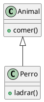
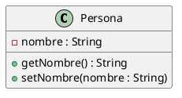
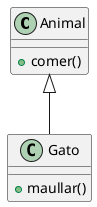
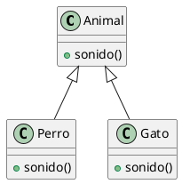
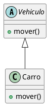

# 📘 POO en Java + Diagramas UML

---

## 🧩 Diagrama de Clases (Ejemplo)

---

## 🔐 Encapsulación

---

## 🧬 Herencia

---

## 🔄 Polimorfismo

---

## 🎯 Abstracción

---

## 📌 Cómo usar estos diagramas

Puedes renderizar estos diagramas usando:

- https://www.plantuml.com/plantuml
- Extensión de PlantUML en VS Code
- Herramientas como IntelliJ IDEA

---

💡 *Practica todos los días, aunque sea 20 minutos.*
